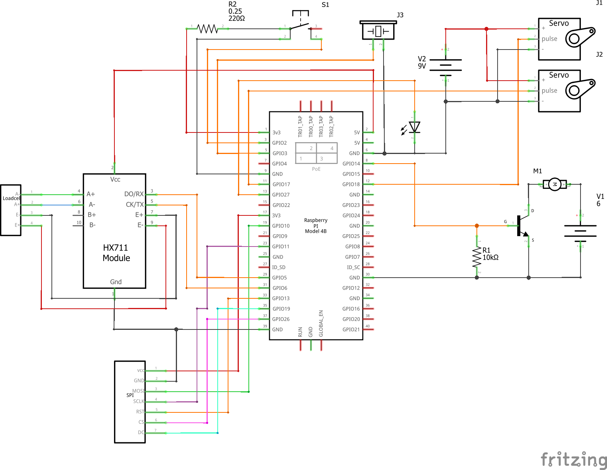

<div align="center"> 
  <p align="center">
    
  </p>

  <h1 align="center">HydroMinder Installer</h1>
  <p align="center">A modern hydration tracker for anyone.</p>
</div>

## Description

This is the installer for HydroMinder.

## Requirements

-   Raspberry Pi 4
-   Raspberry OS Buster 64bit
-   curl
-   USB webcam, available on `/dev/video0` (although you can change this in the `docker-compose.yml`)
-   Motors and servos

## Build the system yourself

To build the Hydrominder you need to build the electric diagram shown in the image below. Five important things to note here.

-   The two servos(31 and 32) are mounted in a pan-tilt mechanism.
-   The pan-tilt mechanism needs to have a camera mounted on it.
-   The pump M1 for the water gun needs to mounted around the camera.
-   The pump for the water gun needs to be placed within a water reservoir, so get a water proof pump. For the first three steps see image 2 to get an idea.
-   It is crucial that you find the correct weight sensor reference unit. We used [this guide](https://tutorials-raspberrypi.com/digital-raspberry-pi-scale-weight-sensor-hx711/), however this depends on your weight-sensor.

The following image shows the electronic design of the system:



## All-In-One Install Command

```bash
$ curl -fsSL https://gitlab.utwente.nl/cs21-32/hydrominderscripts/-/raw/master/install.sh | sudo bash -s
```

## Updating Existing Installations

```bash
$ curl -fsSL https://gitlab.utwente.nl/cs21-32/hydrominderscripts/-/raw/master/update.sh | sudo bash -s
```

## Disclaimer

We, Team 32, do not provide any warranty and are not responsible for any damages caused by possible issues and misconfigurations in our code (Web App, API, Controller, and Scripts).  
We have done our best to make a secure product, but there are a few things out of our control or simply unfeasable. Because of this we recommend the following:

-   Choose strong passwords
-   Keep an eye on your network (if it's compromised the availability cannot be guaranteed)
-   Keep an eye on the physical device (there are no protections in place when the physical device has been compromised)
-   Verify the TLS key's fingerprint with the one displayed on the LCD

## Privacy

HydroMinder itself does not share any personal data with us or third-parties. HydroMinder itself is fully [GDPR compliant](https://gdpr.eu/).

However, there will be comunication with third-parties when installing the required software.  
For the related third parties, please familiarize yourself with these
privacy policies:

-   [GitLab Privacy Policy](https://about.gitlab.com/privacy/)
-   [Docker Privacy Policy](https://www.docker.com/legal/docker-privacy-policy)

## License

HydroMinder Scripts is [MIT licensed](LICENSE).
